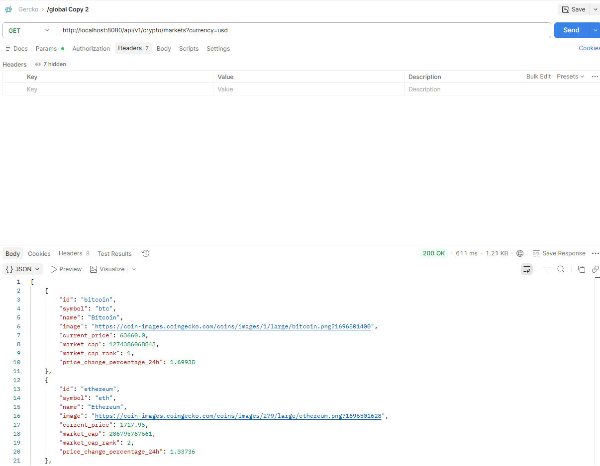
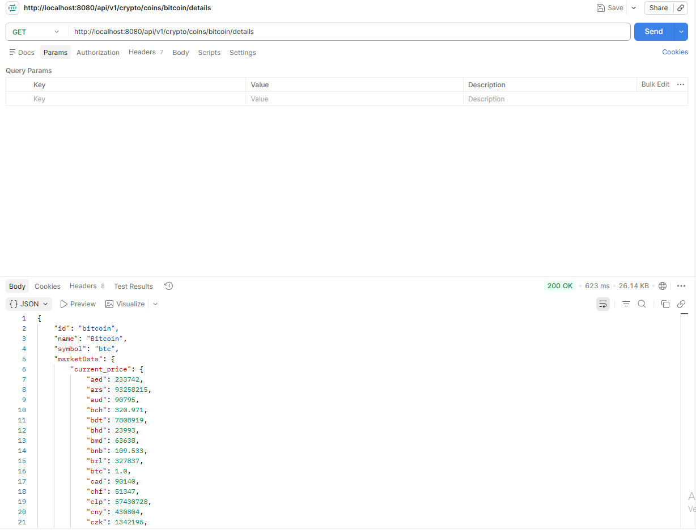
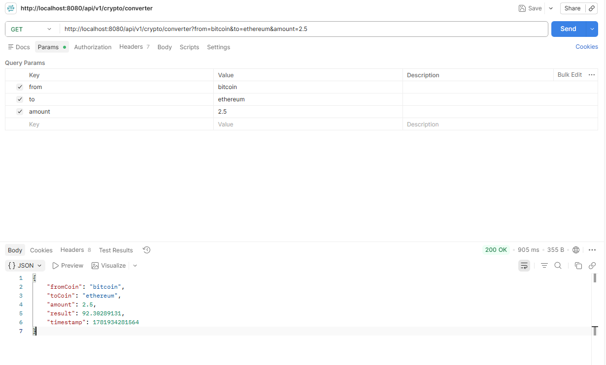
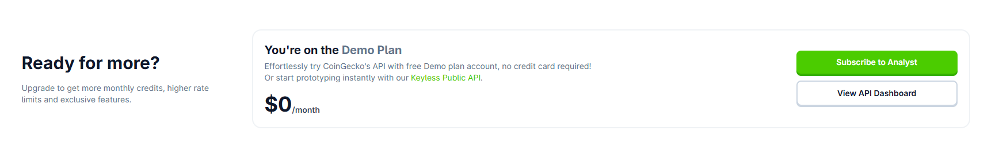

# Crypto-Backend-Service 

Select Language / Selecciona el Idioma:
* [Versión en Español](#-versión-en-español)
* [English Version](#-english-version)


---

🇪🇸 Versión en Español

Este es el motor de servicios backend para la plataforma de criptomonedas. Está desarrollado con **Spring Boot 4**, 
diseñado bajo una arquitectura limpia en tres capas y optimizado para la agregación de APIs externas utilizando programación concurrente y almacenamiento 
en caché de alto rendimiento.

## 🚀 Características Principales

* **Arquitectura BFF (Backend for Frontend):** Centraliza y unifica múltiples peticiones hacia la API externa de CoinGecko para entregar un objeto de datos masticado y optimizado al cliente.
* **Concurrencia Asíncrona:** Implementación de `CompletableFuture` junto con un pool de hilos personalizado (`ThreadPoolTaskExecutor`) para paralelizar peticiones HTTP, reduciendo los tiempos de respuesta a la mitad.
* **Estrategia de Caché Avanzada (Redis):** Reducción de latencia y protección de cuotas de API mediante políticas de caché segmentadas por caso de uso (ej. TTLs cortos para conversión en tiempo real, TTLs largos para mercados).
* **Precisión Financiera:** Uso estricto de `BigDecimal` para todas las operaciones de conversión, garantizando la exactitud de los decimales en el cálculo de activos.

---

## 🛠️ Stack Tecnológico

* **Java 21**
* **Spring Boot 4** (Spring Web, Spring Data Redis)
* **Redis** (Gestión de Caché en memoria)
* **RestClient** (Cliente HTTP síncrono/asíncrono de Spring)
* **Docker** (Para entorno local de Redis)

---

## 📐 Arquitectura y Flujo de Datos

El proyecto sigue el flujo clásico de desacoplamiento de responsabilidades:


1.  **Controller:** Expone los endpoints REST limpios usando variables de ruta y query params.
2.  **Service (Orquestador):** Contiene la lógica de negocio, gestiona el pool de hilos con `CompletableFuture.allOf().join()` y unifica las respuestas en moldes inmutables (`Records` de Java).
3.  **Client:** Componente especializado que encapsula las llamadas HTTP crudas hacia los servidores de CoinGecko.

---

## 🔒 Variables de Entorno Requeridas

Para desplegar o correr este proyecto de forma local, es necesario configurar las siguientes variables de entorno (puedes inyectarlas en tu IDE o sistema operativo):

```yaml
SPRING_DATA_REDIS_HOST: localhost
SPRING_DATA_REDIS_PORT: 6179
COINGECKO_API_KEY: TU_API_KEY_AQUÍ
```

## 🔀 Endpoints de la API

### 1. Listado de Mercados
* **Ruta:** `GET /api/v1/crypto/markets`
* **Descripción:** Devuelve el top de criptomonedas con sus precios y tendencias. Almacenado en caché para optimizar el rendimiento.



### 2. Detalle Profundo y Gráfica
* **Ruta:** `GET /api/v1/crypto/coins/{id}/details`
* **Descripción:** Orquesta dos hilos en paralelo. Trae los datos básicos de la moneda (`/coins/{id}`) y su historial de precios de los últimos 7 días (`/market_chart`), fusionándolos en un solo DTO.



### 3. Calculadora de Conversión
* **Ruta:** `GET /api/v1/crypto/converter`
* **Parámetros:** `from` (moneda origen), `to` (moneda destino), `amount` (monto).
* **Descripción:** Realiza la conversión matemática con precisión de 8 decimales usando `BigDecimal`. Cuenta con una política de caché de expiración rápida (TTL de 30 segundos) para simular cotizaciones en tiempo real.



---

## 🛠️ Instrucciones para Ejecución Local

1. **Crear cuenta en CoinGecko:** Obtener una API Key gratuita con el link https://www.coingecko.com/en/api/pricing 
   y seleccionar el plan gratuito.




2. **Levantar Redis:** Asegúrate de tener Redis corriendo localmente (puedes usar Docker):
```bash
   docker run --name redis-crypto -p 6379:6379 -d redis
   ```

3. **Clonar el repositorio:**

 ```Bash
git clone [https://github.com/toledo96/crypto-backend-service.git]
 ```

4. **Configurar la API Key:** Añade tu token de CoinGecko en las variables de entorno de tu IDE.

 ```
    COINGECKO_API_KEY
 ```

5. **Ejecutar la aplicación:** Arranca el proyecto desde tu IDE o mediante la terminal con:

 ```Bash
./mvnw spring-boot:run
 ```

## 💾 Configuración y Monitoreo de Caché (Redis)

Para optimizar los tiempos de respuesta del microservicio y mitigar el límite de peticiones (rate limiting) de las APIs externas, el proyecto implementa un mecanismo de caché distribuida utilizando **Redis**.

### 🛠️ Arquitectura de la Caché
* **Redis Caching:** Almacenamiento temporal de consultas de alta demanda.
* **Resiliencia de Conexión:** Configuración externalizada con valores por defecto preparados para despliegues locales y entornos contenerizados.

### 📈 Métricas de Redis en Grafana
Al habilitar las métricas de Spring Boot, el tablero de Grafana monitorea automáticamente el comportamiento del cliente de Redis (Lettuce/Jedis) y el pool de conexiones:
* **HikariCP / Connection Pool:** Estado de las conexiones activas, inactivas y tiempos de espera para interactuar con la base de datos en memoria.
* **Cache Hits / Misses:** Volumen de consultas exitosas recuperadas desde la caché versus peticiones que requirieron golpear el backend o servicios externos.

### 🚀 Configuración del Entorno (`application.yml`)
La conectividad se gestiona de manera dinámica para facilitar la portabilidad del entorno de desarrollo a Docker:

```yaml
spring:
   data:
      redis:
         host: ${REDIS_HOST:localhost}
         port: ${REDIS_PORT:6379}
```

## 📊 Observabilidad y Monitoreo

El proyecto cuenta con una infraestructura completa de monitoreo para evaluar el rendimiento y la salud del microservicio en tiempo real utilizando el stack **Prometheus** y **Grafana**.

### 🛠️ Tecnologías Utilizadas
* **Spring Boot Actuator & Micrometer:** Para la exposición y recolección nativa de métricas de la JVM, Tomcat y conexiones.
* **Prometheus:** Servidor de series temporales encargado de realizar el *scraping* de las métricas expuestas.
* **Grafana:** Panel de control visual conectado a Prometheus para la representación gráfica del estado del sistema.

### 📈 Métricas Monitoreadas
* **JVM memory:** Uso y comportamiento de la memoria *Heap* y *Non-Heap*.
* **CPU Usage & Load Average:** Monitoreo del consumo de procesamiento del microservicio.
* **Tomcat Threads:** Hilos activos, ocupados y disponibles en el servidor embebido.
* **Redis Integrations:** Comportamiento de las conexiones externas y almacenamiento en caché.

### 🚀 Cómo Levantar el Entorno de Monitoreo

1. **Asegurar las variables en el `application.yml`**
   El sistema inyecta automáticamente el tag de la aplicación para que Grafana lo reconozca de manera nativa:

```yaml
   management:
     endpoints:
       web:
         exposure:
           include: health, info, prometheus
     metrics:
       tags:
         application: ${spring.application.name}
```

2. **Levantar los contenedores de Docker**
   Ejecuta el siguiente comando en la raíz del proyecto para iniciar Prometheus y Grafana en segundo plano:
```
docker compose up -d
```

3. **Acceso a herramientas**
   - Prometheus UI: http://localhost:9090 (Verifica el estado en Status -> Targets).
   - Grafana Dashboard: http://localhost:3000 (Importa el tablero con el ID 11378 y selecciona el datasource de Prometheus).

### 🔗 Proyecto Completo (Arquitectura Fullstack) 
Este proyecto cuenta con un servicio frontend desarrollado en React que consume esta API, mostrando la información 
de criptomonedas de manera visual e interactiva aquí: 👉 [https://github.com/toledo96/crypto-frontend-service]


# 🚀 Crypto-Backend-Service 

Select Language / Selecciona el Idioma:
* [English Version](#-english-version)
* [Versión en Español](#-versión-en-español)

---

## 🇺🇸 English Version

This is the backend service engine for the cryptocurrency platform. It is developed using **Spring Boot 4**, designed under a clean three-layer architecture, and optimized for external API aggregation leveraging concurrent programming and high-performance caching.

### 🚀 Key Features
* **BFF Architecture (Backend for Frontend):** Centralizes and unifies multiple requests to the external CoinGecko API to deliver a clean, optimized data object to the client.
* **Asynchronous Concurrency:** Implementation of `CompletableFuture` alongside a custom thread pool (`ThreadPoolTaskExecutor`) to parallelize HTTP requests, cutting response times in half.
* **Advanced Caching Strategy (Redis):** Reduces latency and protects API quotas using segmented cache policies based on use cases (e.g., short TTLs for real-time conversion, long TTLs for markets).
* **Financial Precision:** Strict usage of `BigDecimal` for all conversion operations, guaranteeing decimal accuracy in asset calculations.

### 🛠️ Tech Stack
* **Java 21**
* **Spring Boot 4** (Spring Web, Spring Data Redis)
* **Redis** (In-memory Cache Management)
* **RestClient** (Spring's synchronous/asynchronous HTTP client)
* **Docker** (For local Redis environment)

### 📐 Architecture and Data Flow
The project follows the classic decoupling of responsibilities:
1. **Controller:** Exposes clean REST endpoints using path variables and query params.
2. **Service (Orchestrator):** Contains business logic, manages the thread pool using `CompletableFuture.allOf().join()`, and unifies responses into immutable shapes (Java `Records`).
3. **Client:** Specialized component that encapsulates raw HTTP calls to CoinGecko servers.

### 🔒 Required Environment Variables
To deploy or run this project locally, you need to configure the following environment variables (you can inject them into your IDE or OS):
```yaml
SPRING_DATA_REDIS_HOST: localhost
SPRING_DATA_REDIS_PORT: 6179
COINGECKO_API_KEY: YOUR_API_KEY_HERE
```
🔀 API Endpoints
1. Market Listing
Path: GET /api/v1/crypto/markets

Description: Returns the top cryptocurrencies with their prices and trends. Cached for performance optimization.

2. Deep Detail & Chart
Path: GET /api/v1/crypto/coins/{id}/details

Description: Orchestrates two parallel threads. Fetches basic coin data (/coins/{id}) and its price history for the last 7 days (/market_chart), merging them into a single DTO.

3. Conversion Calculator
Path: GET /api/v1/crypto/converter

Parameters: from (source currency), to (target currency), amount (amount).

Description: Performs mathematical conversion with 8-decimal precision using BigDecimal. Features a fast-expiring cache policy (30-second TTL) to simulate real-time quotes.

🛠️ Instructions for Local Execution

1. **Create a CoinGecko Account:** Obtain a free API Key using this link: https://www.coingecko.com/en/api/pricing and select the Analyst/Free plan.


2. **Spin up Redis:** Ensure you have Redis running locally (you can use Docker):
```bash
   docker run --name redis-crypto -p 6379:6379 -d redis
```

3. **Clone the repository:**

 ```Bash
git clone [https://github.com/toledo96/crypto-backend-service.git]
 ```

4. **Configure the API Key:** Add your CoinGecko token to your IDE's environment variables.

 ```
    COINGECKO_API_KEY
 ```

5. **Run the application:** Start the project from your IDE or via terminal using:

 ```Bash
./mvnw spring-boot:run
 ```

💾 Cache Configuration & Monitoring (Redis)
To optimize response times and mitigate rate limiting from external APIs, the project implements a distributed caching mechanism using Redis.

🛠️ Cache Architecture
Redis Caching: Temporary storage for high-demand queries.

Connection Resilience: Externalized configuration with defaults prepared for local deployment and containerized environments.

📈 Redis Metrics in Grafana
By enabling Spring Boot metrics, the Grafana dashboard automatically monitors the behavior of the Redis client (Lettuce/Jedis) and the connection pool:

HikariCP / Connection Pool: Status of active, idle connections and wait times to interact with the in-memory database.

Cache Hits / Misses: Volume of successful queries retrieved from cache versus requests that required hitting the backend or external services.

🚀 Environment Configuration (application.yml)
Connectivity is managed dynamically to facilitate portability from development environments to Docker:
```yaml
spring:
   data:
      redis:
         host: ${REDIS_HOST:localhost}
         port: ${REDIS_PORT:6379}
```

## 📊 Observability and Monitoring

The project features a full monitoring infrastructure to evaluate microservice performance and health in real time using the **Prometheus** and **Grafana** stack.

### 🛠️ Core Technologies
* **Spring Boot Actuator & Micrometer:** For native metric collection and exposure of JVM, Tomcat, and connections.
* **Prometheus:** Time-series server responsible for scraping exposed metrics.
* **Grafana:** Visual dashboard connected to Prometheus for system status representation.

### 📈 Monitored Metrics
* **JVM memory:**Heap and Non-Heap memory usage and behavior.
* **CPU Usage & Load Average:** Processing consumption monitoring of the microservice.
* **Tomcat Threads:** Active, busy, and available threads in the embedded server.
* **Redis Integrations:** External connection behavior and cache storage.
  
### 🚀 How to Spin Up the Monitoring Environment

1. **Ensure variables in `application.yml`**
   The system automatically injects the application tag for native Grafana recognition:

```yaml
   management:
     endpoints:
       web:
         exposure:
           include: health, info, prometheus
     metrics:
       tags:
         application: ${spring.application.name}
```

2. **Spin up Docker containers**
  Run the following command at the project root to start Prometheus and Grafana in the background:
```
docker compose up -d
```

3. **Tool Access**
   - Prometheus UI: http://localhost:9090 (Verify status under Status -> Targets).
   - Grafana Dashboard: http://localhost:3000 (Import dashboard ID 11378 and select the Prometheus datasource).

### 🔗 Full-Stack System Architecture
This project features a frontend service developed in React that consumes this API, displaying cryptocurrency information visually and interactively here: 👉 [https://github.com/toledo96/crypto-frontend-service]
